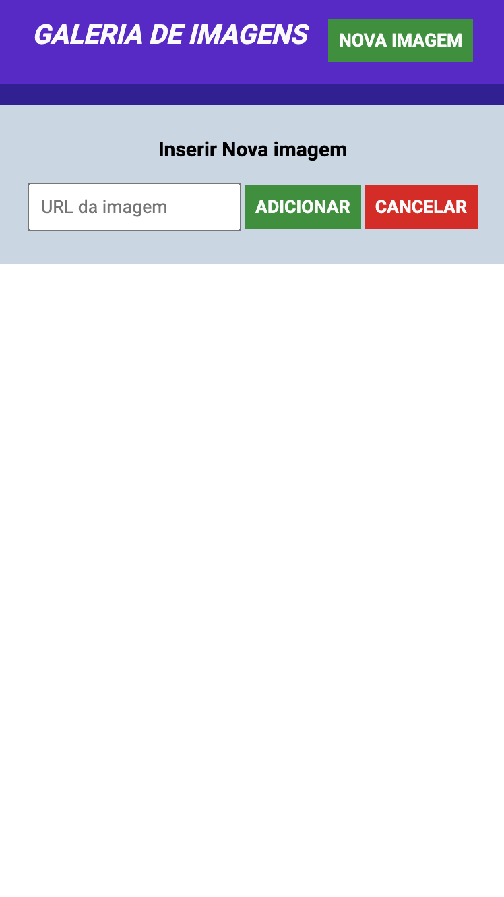
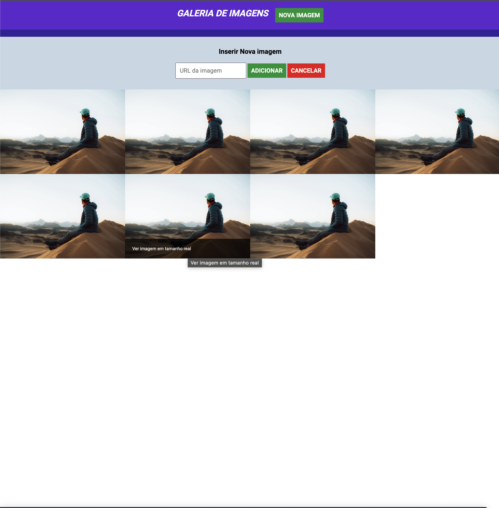

## ☕ Sobre o projeto

Este projeto consiste em um galeria de imagens com funcionalidades básicas de adição de novas imagens.Utiliza HTML, CSS e JQuery para interações dinâmicas

## ⚙️ Funcionalidades

- **Expansão de formulário com uso do jQuery:** Capacidade de exibir e ocultar dinamicamente um formulário de adição de imagem por meio de eventos controlados pelo jQuery.
- **Formulário de adição de imagem (aceitando o endereço das imagens na internet):** Permite que os usuários insiram URLs de imagens da internet para serem adicionadas à galeria.
- **Efeito de surgir a imagem (fade-in):** Utilização do efeito `fadeIn()` do jQuery para exibir suavemente novas imagens adicionadas à galeria, proporcionando uma transição visual agradável.
- **Efeito de surgir e desaparecer texto em frente à imagem:** Implementação de um efeito onde o texto surge e desaparece sobre as imagens ao passar o mouse sobre elas. Esse efeito é realizado com transições suaves ou animações do jQuery.
- **Adição de eventos usando jQuery:** Utilização de eventos como `click()`, `hover()`, `submit()`, entre outros, para controlar a interatividade e funcionalidades do projeto.
- **Aplicação de efeitos de animação:** Demonstração do uso de efeitos de animação com jQuery para criar transições dinâmicas, melhorando a experiência do usuário na galeria de imagens.

## 🛠️ Tecnologias Utilizadas

## 🎨 Layout

<table>
  <tr>
    <td align="center"></td>
    <td align="center"></td>
    <td align="center"></td>
  </tr>
  
</table>

## 📚 Bibliotecas e Plugins

- [JQuery](URL_do_Link)
