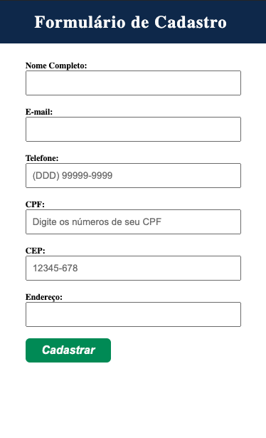
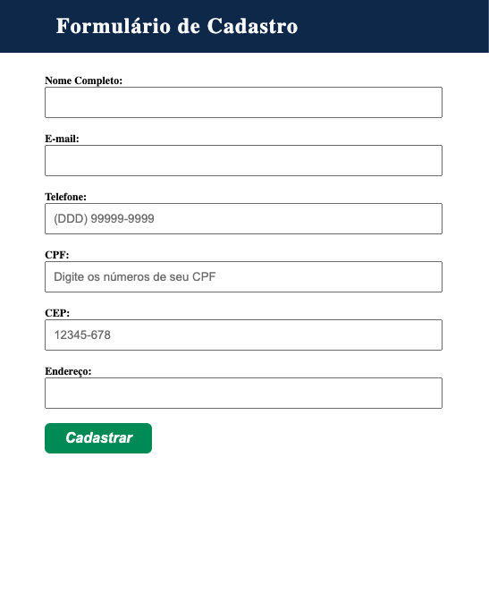
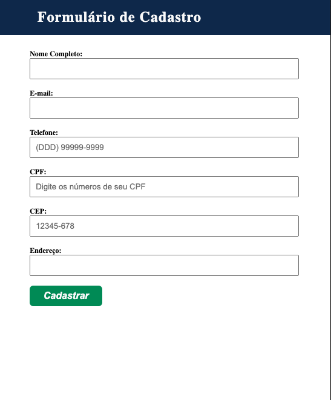

## ☕ Sobre o projeto
Este projeto foi desenvolvido utilizando HTML, CSS e JavaScript, com a integração do JQuery para a aplicação de máscaras nos campos de CPF, telefone e CEP. Foi adotado o uso de medidas em "rem" para a consistência e flexibilidade do design em diferentes dispositivos. Além disso, foram implementadas media queries para garantir uma experiência adaptável em três tamanhos de tela distintos: mobile, tablet e desktop. O objetivo principal é criar um formulário de cadastro com campos como Nome, E-mail, Telefone, CPF, Endereço e CEP, visando aprimorar a experiência do usuário ao preencher tais informações.

## 🛠️ Tecnologias Utilizadas

## 🎨 Layout
| Mobile         | Tablet         | Desktop        |
| -------------- | -------------- | -------------- |
|  |  |  |

## 📚 Bibliotecas e Plugins
- JQuery: Versão 1.11.0 e JQuery Migrate 1.2.1
- JQuery Mask Plugin
- JQuery Validation Plugin
- Messages PT-BR Plugin
