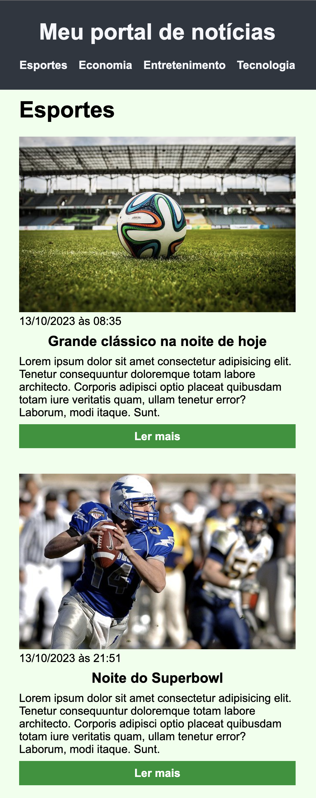
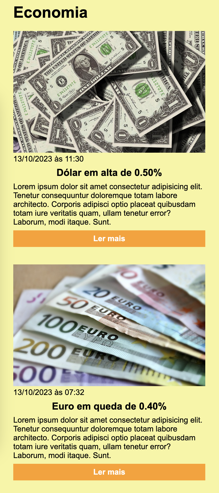

# Exercício CSS
Criar duas seções no layout criado durante o módulo, por exemplo: entretenimento e tecnologia, as novas seções devem conter outras notícias e diferentes cores;
## Resultado do exercício

Aqui estão algumas capturas de tela do projeto em diferentes tamanhos de tela:

  
  

  
  

  
  

  

