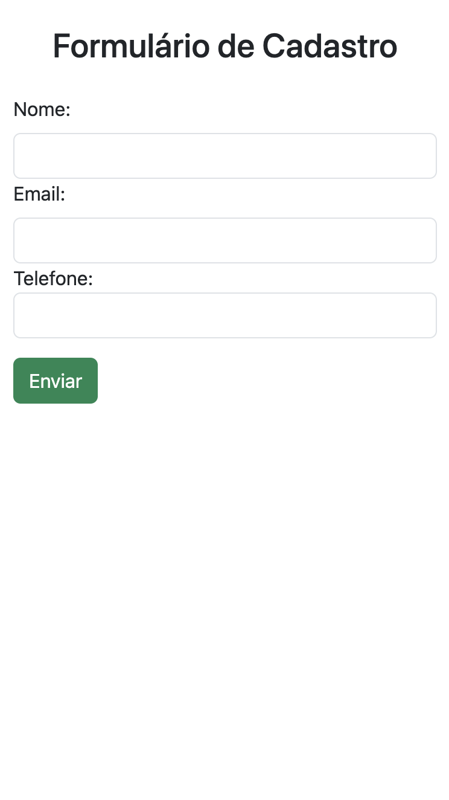
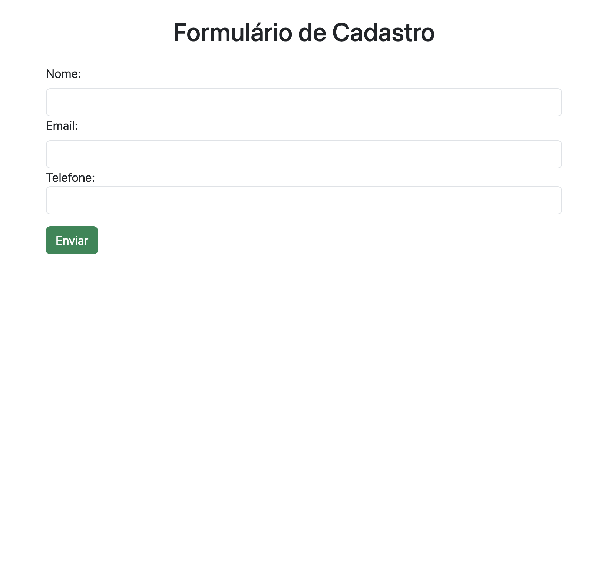

## ☕ Sobre o projeto
Este projeto se concentra na integração do Bootstrap em uma página HTML usando a CDN. A principal tarefa envolve a criação de um formulário de cadastro com campos para nome, e-mail e telefone. Além disso, requer a aplicação das classes do Bootstrap nos elementos do formulário para garantir estilos e layout adequados.

## 🛠️ Tecnologias Utilizadas

## 🎨 Layout
| Mobile         | Tablet         | Desktop        |
| -------------- | -------------- | -------------- |
|  |  |  |
