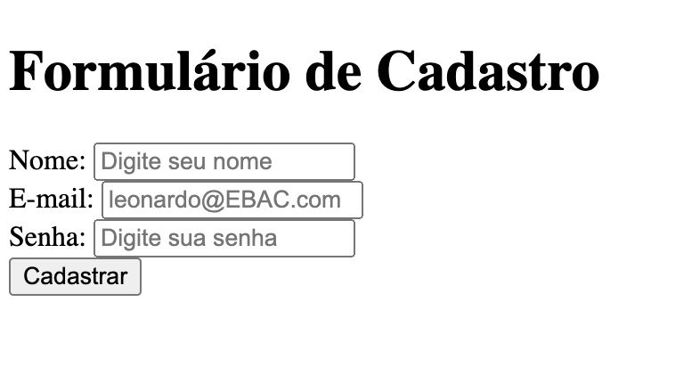

# Engenheiro_Front-end

Criar um arquivo HTML que contenha um formulário de cadastro, com os campos nome, e-mail e senha e a existência de um botão para realizar o cadastro;

Adicionar também uma label para cada campo e referenciar essa label ao ID que será atribuído ao campo;

## Imagem do Projeto

